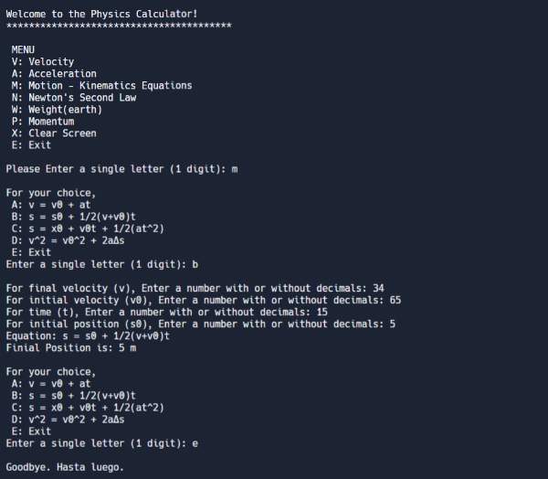

# CPPphysicsCalculator

Using custom header files for functions and input validation to create a program that calculates Physics (Mechanics) problems. Outputting the equation used to solve the problem and the answer. 
